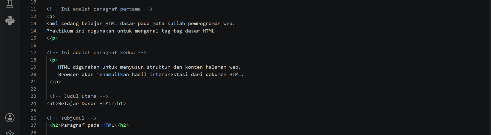

# Lab1Web
## Identitas Mahasiswa
Nama: Alfi Iftihal Nurul Afiat
Nim: 312510041
Mata Kuliah: Pemograman Web
Praktikum: 1-HTML Dasar
## Deskripsi Praktikum
Praktikum ini membahas dasar dasar HTML (HyperText Markup Language) untuk membuat struktur halaman web sederhana.
Pada praktikum ini dilakukan pembuatan dokumen HTML dengan menerapkan:
- Struktur dasar HTML5
- Tag dan elemen HTML
- Heading
- Paragraf
- Formatting teks
- Gambar
- Hyperlink internal dan eksternal
- List HTML
- Komentar HTML
  ## Tujuan Praktikum
  Tujuan dari praktikum ini adalah:

1. Memahami struktur dasar dokumen HTML.
2. Memahami penggunaan tag-tag dasar HTML.
3. Membuat halaman web sederhana menggunakan HTML.
## Struktur Repository
```
Lab1Web/
│
├── index.html
├── halaman2.html
├── images/
│   └── profil.jpg
│
└── README.md
```
## Langkah Praktikum

## 1. Membuat Struktur Dasar HTML
pada tahap awal dibuat dokumen HTML5 menggunakan deklarasi:
```html
<!DOCTYPE html>
```
Kemudian dibuat struktur utama HTML yang terdiri dari:
- `<html>`
- `<head>`
- `<title>`
- `<body>`
Hasil:

---
## 2. Membuat Heading dan Paraghraf
Heading digunakan untuk membuat judul dan subjudul pada halaman web.
Tag yang digunakan:
```html
<h1>
<h2>
```
Sedangkan paraghraf dibuat menggunakan:
```html
<p>
```
Hasil:



