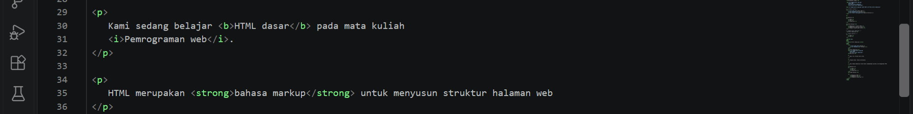
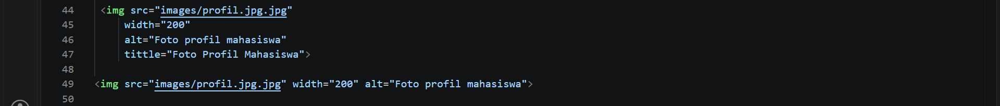
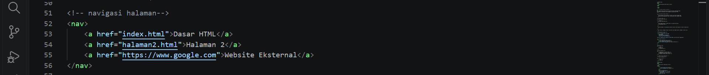
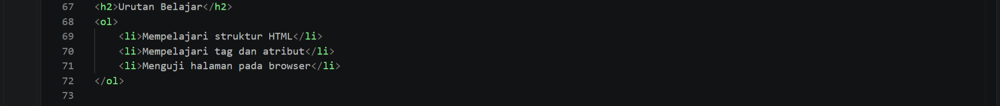
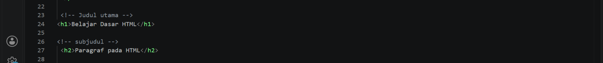

# Lab1Web
## Identitas Mahasiswa
Nama: Alfi Iftihal Nurul Afiat
Nim: 312510041
Mata Kuliah: Pemograman Web
Praktikum: 1-HTML Dasar
## Deskripsi Praktikum
Praktikum ini membahas dasar dasar HTML (HyperText Markup Language) untuk membuat struktur halaman web sederhana.
Pada praktikum ini dilakukan pembuatan dokumen HTML dengan menerapkan:
- Struktur dasar HTML5
- Tag dan elemen HTML
- Heading
- Paragraf
- Formatting teks
- Gambar
- Hyperlink internal dan eksternal
- List HTML
- Komentar HTML
  ## Tujuan Praktikum
  Tujuan dari praktikum ini adalah:

1. Memahami struktur dasar dokumen HTML.
2. Memahami penggunaan tag-tag dasar HTML.
3. Membuat halaman web sederhana menggunakan HTML.
## Struktur Repository
```
Lab1Web/
│
├── index.html
├── halaman2.html
├── images/
│   └── profil.jpg
│
└── README.md
```
## Langkah Praktikum

## 1. Membuat Struktur Dasar HTML
pada tahap awal dibuat dokumen HTML5 menggunakan deklarasi:
```html
<!DOCTYPE html>
```
Kemudian dibuat struktur utama HTML yang terdiri dari:
- `<html>`
- `<head>`
- `<title>`
- `<body>`
Hasil:

---
## 2. Membuat Heading dan Paraghraf
Heading digunakan untuk membuat judul dan subjudul pada halaman web.
Tag yang digunakan:
```html
<h1>
<h2>
```
Sedangkan paraghraf dibuat menggunakan:
```html
<p>
```
Hasil:


---
## 3. Formatting Text
Pada tahap ini dilakukan performatan teks menggunakan beberapa tag HTML seperti:
```html
<b>
<i>
<strong>
```
Contoh penggunaan:
```html
<p>
Belajar <b>HTML Dasar</b>
</p>
```
Hasil:


---
## 4. Menambahkan gambar
Gambar ditaambahkan menggunakan tag:
```html

```
dengan atribut:
- `src` untuk lokasi gambar
- `alt` untuk deskripsi gambar
contoh:
```html

```
Hasil:


---
## 5. Membuat Hyperlink
Hyperlink digunakan untuk menghubungkan halaman web.
Pada praktikum ini dibuat:
### Hyperlink Internal 
Menghubungkan halaman `index.html` dengan `halaman2.html`.
contoh:
```html
<a href="halaman2.html">
Halaman 2
</a>
```
### Hyperlink Eksternal
Menghubungkan ke website lain.
Contoh:
```html
<a href="https://www.google.com">
Google
</a>
```
Hasil:


---
## 6. Membuat List HTML
Terdapat dua jenis list yang digunakan:
### Unordered List
List menggunakan tanda bullet.
```html
<ul>
<li>HTML</li>
<li>CSS</li>
</ul>
```
### Ordered List
List menggunakan urutan angka.
```html
<ol>
<li>Belajar HTML</li>
<li>Membuat Website</li>
</ol>
```
Hasil:



---
## 7. Membuat Komentar HTML
Komentar digunakan untuk memberikan catatan pada kode HTML.
Komentar ditulis menggunakan:
```html
<!-- komentar -->
```
Komentar tidak akan tampil pada halaman browser.
Hasil:


---
# Hasil Website
Website hasil praktikum telah berhasil dibuat menggunakan HTML dasar dan dapat dijalankan melalui GitHub Pages.
Link Website:


